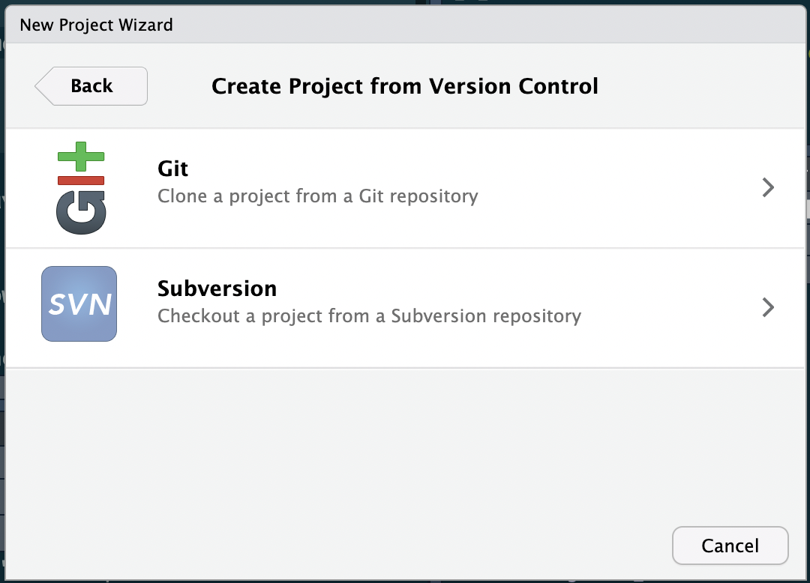
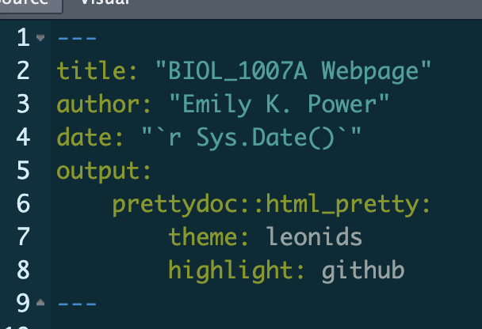

## Part 1: Making your GitHub Account  
1. Visit the [GitHub Homepage](https://github.com)  
2. Click [Sign Up](https://github.com/signup?ref_cta=Sign+up&ref_loc=header+logged+out&ref_page=%2F&source=header-home)
3. Follow the prompts to create your free GitHub account!  

## Part 2: Installing Git and RStudio  
  
### 1. Installing RStudio:  
1. Install R on your local computer. Follow the prompts on [this page](https://cran.rstudio.com/), making sure to install the version compatible with your device and software.  
2. Install [RStudio Desktop](https://support--rstudio-com.netlify.app/products/rstudio/download/). 
3. Open RStudio on your local computer.  

### 2. Installing Git:  
**Method 1:**  
To download Git on your local computer, follow the prompts displayed on [this page](https://git-scm.com/downloads) depending on your device model. *For instance, on a macOS, you'll need to install [Homebrew](https://brew.sh/) before proceeding to install [Xcode](https://developer.apple.com/xcode/) and so forth.*

**Method 2:**  
1. Run the following code in your Terminal in RStudio on your local device:  
    `/bin/bash -c "$(curl -fsSL https://raw.githubusercontent.com/Homebrew/install/HEAD/install.sh)"`  
2. Next, run the following code in the same Terminal:  
    `brew install git`  
    

* To check if Git was installed properly, navigate to **File** and click **New Project**, then **Version Control**.   
    * If Git was installed properly, your screen should look like this:   {width=30%}  
    * If no **Git** icon appears, consider the tips listed below.  
  
### Troubleshooting Tips:
  * Ensure your device is up to date on the most recent software. If not, download an older version of Xcode that is compatible with your software update.
  * Download [Xcode Command Line Tools](https://idmsa.apple.com/IDMSWebAuth/signin.html?path=%2Fdownload%2Fall%2F&appIdKey=891bd3417a7776362562d2197f89480a8547b108fd934911bcbea0110d07f757&rv=0).
  * See [this video](https://www.youtube.com/watch?v=SOjSNB7F2m4) if Homebrew is installed but Git will not install.  

## Part 3: Creating a Remote Repository on GitHub  
1. Visit [GitHub](https://github.com/) and click ['create a new repository'](https://github.com/new). 
   * Name your repository (eg. *'BIOL_1007A'*)
   * Enter a description (eg. *'This repo is for the Reproducible Biology course.'*)
   * Choose **Public** visibility
   * Under *'Initialize this repository with:'*, add a **README file** to provide a longer description of your project
   * Leave 'Add .gitignore' on the default template (**'None'**)
   * Choose the **MIT License**
2. Click **Create repository**.  

You now have a remote repository that you can use to access your projects **from any device**. Next, you must clone the repository in RStudio in order to add projects to your repository locally.

## Part 4: Cloning the Repository in RStudio  
1. On your GitHub repository page, click the **Code** button.
2. Under the **Local** tab, copy the link to your repository using **HTTPS** format.
3. Open RStudio on your local computer.
4. Under **File**, click **New Project**, then **Version Control**, then **Git**. 
5. Paste your repository URL, name your project directory (eg. 'BIOL_1007A') and create project as subdirectory of wherever you'd like to access your repository (eg. your desktop).
6. Click **Create Project**.  

## Part 5: Creating an Rmarkdown Document in RStudio  
Now it's time to design your webpage in RStudio.  

1. Under **File**, click **New File** then **R Markdown**. 
2. Title your document whatever you want to appear at the top of your webpage. Choose **HTML** as your default output and click **OK**.
3. Once your document has been created, click **File** then **Save**. Name your document 'index' and save as an Rmd file.  
4. Edit your document however you want. For a preview of what your webpage will look like, click the **Knit** icon. Make sure to periodically save your changes as well. 
    * *For help with formatting in Rmarkdown, see this [Cheat Sheet](https://www.rstudio.com/wp-content/uploads/2015/02/rmarkdown-cheatsheet.pdf).*
    * To add a theme to your webpage, you can install the **prettydoc** package by entering `install.packages("prettydoc")` into your Console.
      * Explore [pretty doc themes](https://prettydoc.statr.me/themes.html) and enter the theme of choice into your output as shown below: {width=30%}

## Part 6: Committing and Pushing Changes from RStudio to GitHub  
Once you've finished crafting your webpage, you can commit your changes and push them to GitHub.  

1. In your **Terminal**, enter `git status` to display the change you made.  
2. Next, enter `git add -A` in your **Terminal** to add all the current directory files for next commit.
3. Next, enter `git commit -am` in your **Terminal** to commit changes to your local repository.  
4. If all previous actions were successful, enter `git push` into your **Terminal** to push your project to your remote repository on GitHub.

## Part 7: Publishing your Webpage  
1. On GitHub, navigate to your repository page and click **Settings** then **Pages** under the 'Code and automation' section of the sidebar. 
2. Under 'Build and deployment', navigate to **Branch** and select the **main** branch as a publishing source and click **Save**. 
3. Your webpage should now be active. To access it, enter the URL https://**[your_GitHub_username]**.github.io/**[your_repository_name]**/
    * eg. https://ekpower.github.io/BIOL_1007A/
    * *Note: It may take a few minutes to activate your webpage*