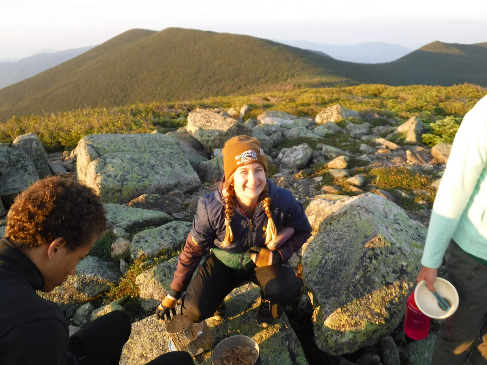
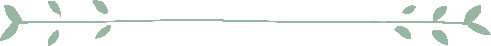

 

### Dear Reader,  
  Hi! My name is Emily (she/her) and I am a senior feb at Middlebury College majoring in Conservation Biology and minoring in Psychology. This J term (2023), I'm taking a class called *Reproducible Biology in R* where I'm learning the basics of reproducible coding in R and RStudio that I can apply in my future biology courses and research. This webpage serves as a repository for my assignments and a potential resource for other Biology students out there!   

## Daily Assignments

[Assignment 1](Daily Assignments/Assignment_1.html)

[Assignment 2](Daily Assignments/Assignment_2.html)

[Assignment 3](Daily Assignments/Assignment_3.html)

[Assignment 4](Daily Assignments/Assignment_4.html)

[Assignment 5](Daily Assignments/Assignment_5.html)

[Assignment 6](Daily Assignments/Assignment_6.html)

[Assignment 7](Daily Assignments/Assignment_7.html)

## Weekly Assignments

[GitHub Webpage Guide](Weekly Assignments/Weekly_Assignment_1.html)

[Creating Functions](Weekly Assignments/Weekly_Assignment_2.html)